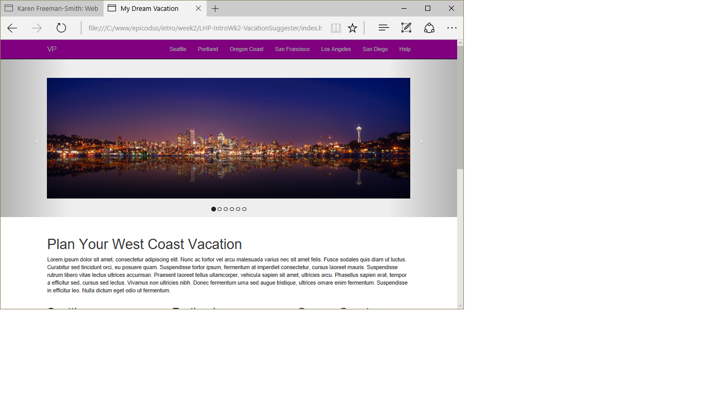

# Amusement Park Rides
Version 0.0.2: August 12, 2016
by [Karen Freeman-Smith](https://karenfreemansmith.github.io)

### Technologies Used
HTML, CSS, Bootstrap, JavaScript, jQuery

## Description
*[Learn How To Program](http://learnhowtoprogram.com) Intro to Programming Week 2 Individual Project: Adds vacation suggester to a basic website for a vacation to explore Bootstrap features.*

* Second version adds a "[suggestion](http://karenfreemansmith.github.io/vacation/customvisit.html)"
feature that allows visitor to fill out a survey and get suggestions for what to do on
vacation based on their answers.

## Setup/Installation
* [View on Github Pages](https://karenfreemansmith.github.io/LHP-IntroWk2-VacationSuggester)
* _OR_
* Clone directory
* Open index.html in your favorite browser

## Support & Contact
For questions, concerns, or suggestions please email karenfreemansmith@gmail.com

## Known Issues
* Currently, only the indoors/outdoors question is considered.

## Legal
*Licensed under the GNU General Public License v3.0*

Copyright (c) 2016 Copyright _[Karen Freeman-Smith](https://karenfreemansmith.github.io)_ All Rights Reserved.
